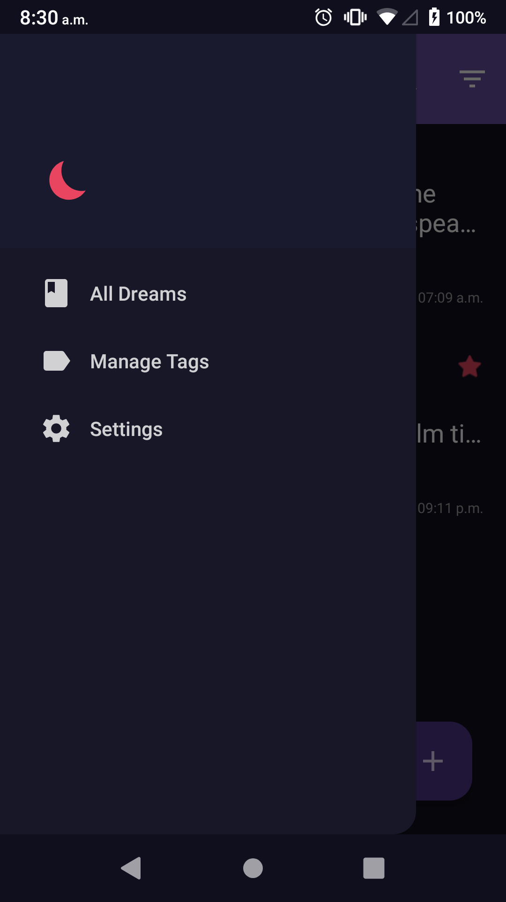
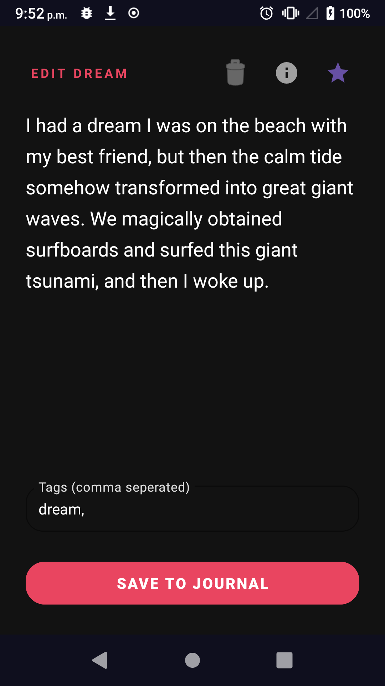
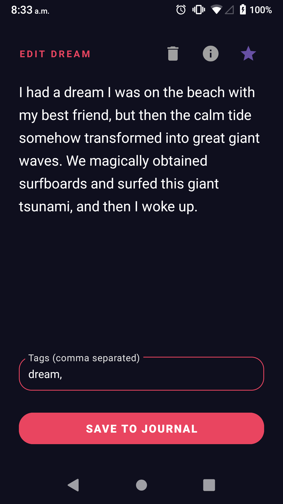
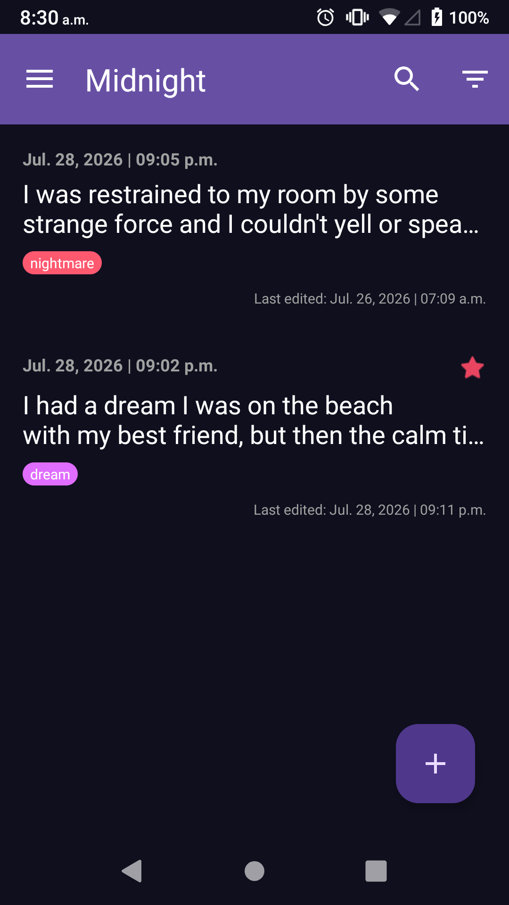
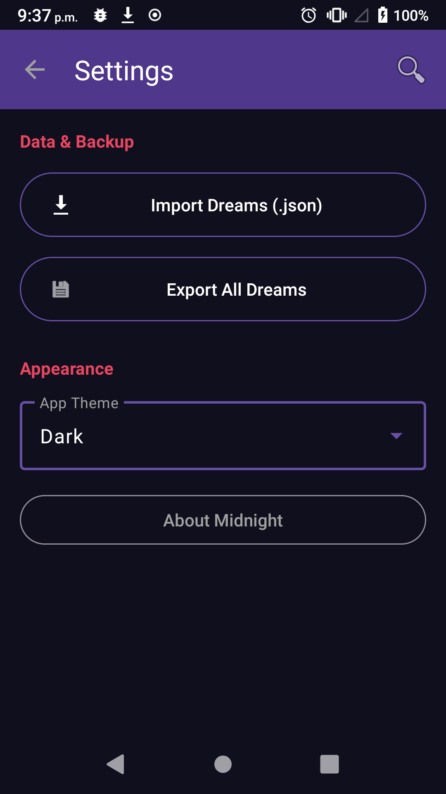

  
  <h1>Midnight</h1>
  
A simple, no-nonsense dream journal for Android.

  
  
  
  
  

  

---

Midnight is a dream journaling app for Android. The goal is to keep it easy to use and user-friendly: open it, write your dream, done.

## Screenshots

  
  
  
  
  

## Features

- **Tagging**: organize your entries with custom color-coded tags. nightmare, lucid, fever dream, whatever works for you
- **Favorites**: star entries to mark the ones worth remembering
- **Filtering**: filter your journal by tag, favorites, or both
- **Export and import**: back up your entries as JSON, or export to plain text if you're moving to another app
- **Themes**: dark mode and light mode, pick your poison
- **It's local**: no accounts, no cloud, no data leaving your device

## Download

Grab the latest APK from the [Releases](https://github.com/misterwaztaken/midnight/releases) page.
(Or [get it from F-Droid](https://f-droid.com/packages/com.kaz.midnight)!)

## License

[GPL-3.0](LICENSE)
